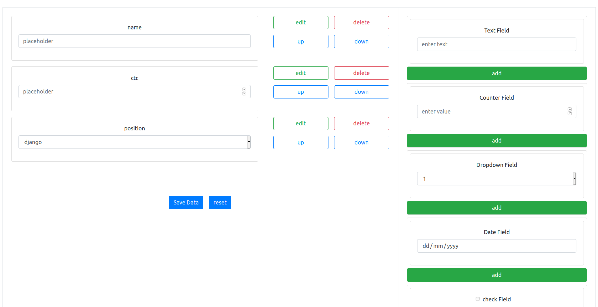

# Form Creator

Web Page for creating dynamic form's without code



### Layout description
- On the right side we have selection pannel providing us choices
- On the ledt side we have the created form elements
    - Each element is <b>editable</b>
    - Newly created elements are appended in the list
    - Elements can be reordered as needed.
- At bottom of the form we have 2 options
    - Save data : downloads the form description in json format
    - reset : resets to initial state

### State Management
- We have `elem_list` as global state variable.
- On addition on new element, its appended to `elem_list`
- Each element has type and variables describing render style and content
```json
{
    "id": "count",
    "type": "type",
    "title": "title",
    "placeholder": "placeholder",
    "options": [],
    "value": "value",
}
```
- change in order of element is achived my changing there order in `elem_list`.
- State is managed using `useState` hooks.
- To make the data persistane i utilized `useEffect` and `localstorage`. On every element update localstorage in updated and on page reload data from locastorage is called and setted.